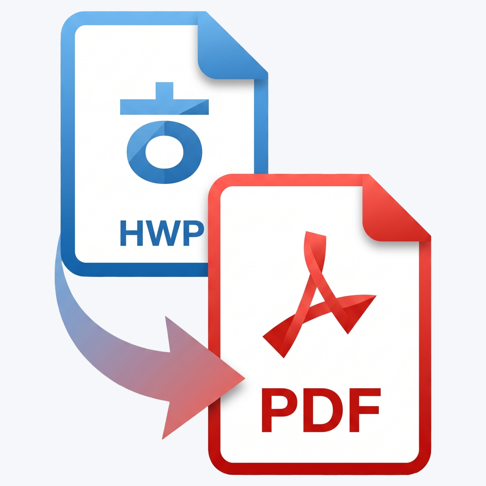

<div align="center">



# hwp2pdf+

**HWP to PDF Plus** — 여러 개의 HWP·HWPX 파일을 한 번에 PDF로 변환하는 Windows 도구

[](LICENSE)


</div>

---

## 소개

`hwp2pdf+`는 한글(HWP·HWPX) 문서를 **드래그 & 드롭 한 번으로 여러 개씩 PDF로 일괄 변환**합니다. 개인·기업·기관 누구나 **무료로 제약 없이** 사용할 수 있습니다.

명령줄(CLI) 모드도 지원하므로 배치 스크립트나 자동화에도 바로 쓸 수 있습니다.

## 특징

- **HWP·HWPX 일괄 변환** — 파일 여러 개, 폴더 통째로(하위 폴더까지 재귀 수집) 한 번에.
- **드래그 & 드롭 GUI** — 목록에 끌어다 놓고 버튼 한 번. 파일별 진행 상태(대기 / 변환 중 / 완료 / 실패) 표시.
- **한글 버전에 강함** — 한글 오토메이션을 **늦은 바인딩(late binding)** 으로 호출하여, 한글 2010부터 2024까지 어떤 버전이든 인터페이스 차이로 깨지지 않습니다. *(구버전 타입 라이브러리로 조기 바인딩된 도구가 한글 2024에서 실행 즉시 죽던 문제를 해결한 것이 이 프로젝트의 출발점입니다.)*
- **편의 기능** — 중복 파일 자동 제거, 기존 PDF 덮어쓰기 옵션, `Delete` 키로 목록 항목 제거.
- **CLI 모드** — GUI 없이 인자로 파일·폴더를 넘겨 일괄 변환.

## 요구 사항

| 항목 | 내용 |
|---|---|
| 운영체제 | Windows 10 / 11 |
| **한컴오피스 한글** | **2010 SE 이상 반드시 설치** (이 프로그램은 자체 변환 엔진이 없으며, 설치된 한글을 자동화로 원격 조종합니다) |
| HWPX 변환 | 한글 2020 이상(설치된 한글이 hwpx를 열 수 있어야 함) |
| .NET Framework | 4.x (Windows 10/11에 기본 내장) |

> 한글이 설치되지 않은 PC, 또는 MS Office·LibreOffice만 있는 PC에서는 동작하지 않습니다.

## 설치

1. [Releases](../../releases)에서 `hwp2pdf-plus.exe`를 내려받습니다.
2. 아무 폴더에나 두고 실행합니다. **별도 설치 과정이 없습니다.** (삭제도 파일만 지우면 끝)

> **SmartScreen 경고가 뜨는 경우**: "Windows의 PC 보호" 창에서 **[추가 정보]** → **[실행]** 을 누르면 됩니다. (서명되지 않은 개인 배포 앱이라 나타나는 정상적인 경고입니다.)

## 사용법

### GUI

1. `hwp2pdf-plus.exe` 실행.
2. HWP·HWPX 파일이나 폴더를 창에 **드래그 & 드롭** (또는 `[파일 추가]`).
3. `[PDF 변환]` 클릭.
4. **PDF는 각 원본 파일과 같은 위치에 생성**됩니다.

- `기존 PDF 덮어쓰기` 체크 시 같은 이름의 PDF가 있어도 다시 만듭니다(기본값은 건너뜀).
- 목록에서 항목을 선택하고 `Delete` 키로 제거할 수 있습니다.

### CLI

```bat
:: 파일 하나
hwp2pdf-plus.exe "C:\문서\보고서.hwp"

:: 여러 개
hwp2pdf-plus.exe "a.hwp" "b.hwpx"

:: 폴더 통째로 (하위 폴더 포함)
hwp2pdf-plus.exe "C:\문서폴더"
```

종료 코드: `0` 전부 성공 / `2` 실패 있음 / `1` 대상 파일 없음.

## 소스 빌드

.NET Framework에 포함된 C# 컴파일러로 단일 파일을 빌드합니다.

```bat
csc.exe /target:winexe /codepage:65001 /win32icon:res\app.ico /resource:res\app.ico,app.ico /out:hwp2pdf-plus.exe Program.cs
```

`csc.exe`는 보통 `C:\Windows\Microsoft.NET\Framework\v4.0.30319\csc.exe`에 있습니다.

## 동작 원리

`HWPFrame.HwpObject` COM 오브젝트(한글 오토메이션)를 **IDispatch 늦은 바인딩**으로 호출해, 설치된 한글이 문서를 열고 PDF로 저장(`SaveAs ... "PDF"`)하도록 합니다. 한컴의 코드나 타입 라이브러리를 포함·재배포하지 않으므로 라이선스 충돌이 없습니다.

## 한계

- 한글이 설치되지 않은 PC에서는 사용할 수 없습니다.
- 암호가 걸린 문서 등 일부 파일은 변환에 실패할 수 있습니다.
- 변환 품질·레이아웃은 설치된 한글의 PDF 저장 결과를 따릅니다.

## 라이선스

[MIT License](LICENSE) © 2026 gomgom
